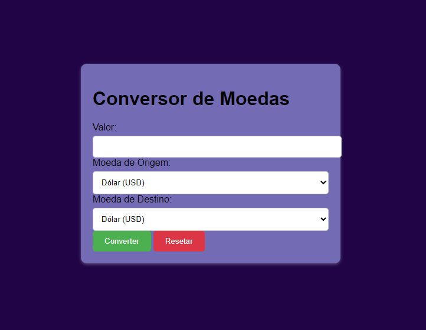

# CONVERSOR DE MOEDAS API
Este repositório é uma melhoria que contém o código-fonte para um [conversor de moedas simples]() baseado na web. Ele permite que os usuários convertam valores monetários entre diferentes moedas utilizando taxas de câmbio obtidas de uma API externa.

# TECNOLOGIAS ULTILIZADAS 
* HTML: Estrutura da página.
* JavaScript: Lógica da aplicação, incluindo interação com o usuário e requisições à API.

1. # PÁGINA INICIAL
*  A página inicial contém um formulário com campos para:
    * Valor a ser convertido.
    * Moeda de origem (selecionada através de um dropdown).
    * Moeda de destino (selecionada através de um dropdown).
    * Botão para iniciar a conversão.

2. # CONVERSÃO
* Ao clicar no botão, o JavaScript entra em ação:
    * Ele recupera o valor, moeda de origem e moeda de destino digitados pelo usuário.
    * Utiliza a função &lt;getExchangeRate&gt; para buscar a taxa de câmbio da moeda de origem para a moeda de destino.
    * Se a taxa de câmbio for obtida com sucesso:
        * Calcula o valor convertido.
        * Exibe o resultado na tela, mostrando o valor convertido e a moeda de destino.
    * Caso contrário, exibe uma mensagem de erro informando que não foi possível recuperar a taxa de câmbio.

### API Key
O código utiliza uma API Key para acessar as taxas de câmbio. A API Key atual utilizada está definida na variável &lt;apiKey&gt; (substitua pelo seu próprio valor). É importante obter sua própria API Key de um provedor de API de taxas de câmbio como o exchangerate-api.com. 

# ESTRUTURA DO CÓDIGO
O código consiste em dois arquivos principais:

* index.html: Contém a estrutura HTML da página, incluindo o formulário e a área de exibição do resultado.
* script.js: Contém o código JavaScript que implementa a lógica da aplicação.

# RESULTADO 
O projeto final pode ser visto conforme imagem abaixo:

# REFERENCIAS 

